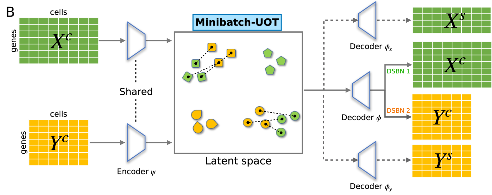
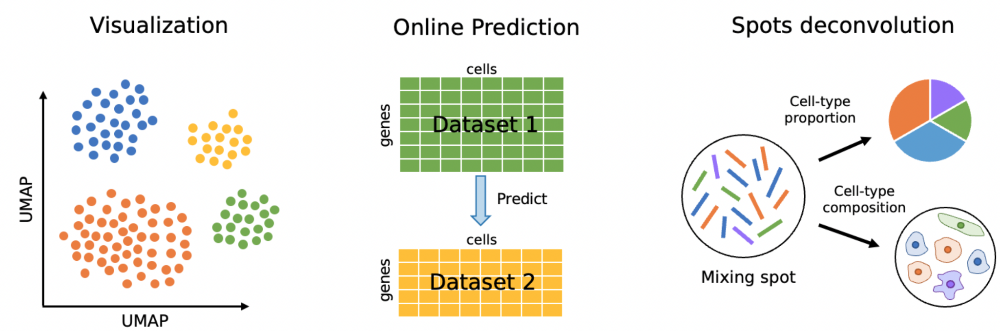

[](https://opensource.org/licenses/MIT)
[](https://badge.fury.io/py/POT)
[](https://uniport.readthedocs.io/en/latest/?badge=latest)
[](https://pepy.tech/project/uniport)

The original paper: 
[a unified single-cell data integration framework with optimal transport](https://www.biorxiv.org/content/10.1101/2022.02.14.480323v1)




Website and documentation: [https://uniport.readthedocs.io](https://uniport.readthedocs.io)

Source Code (MIT): [https://github.com/caokai1073/uniport](https://github.com/caokai1073/uniport)

Author's Homepage: [www.caokai.site](https://www.caokai.site)

## Installation

The `uniport` package can be installed via pip:

```sh
pip3 install uniport
```

## Usage

```Python
adata = up.Run(adatas=None, adata_cm=None, mode='h', lambda_s=0.5, labmda_recon=1.0, lambda_kl=0.5, lambda_ot=1.0, reg=0.1, reg_m=1.0, batch_size=256, lr=2e-4, max_iteration=30000, seed=124, gpu=0, Prior=None, label_weight=None, ref_id=None, save_OT=False, use_specific=True, loss_type='BCE', outdir='output/', out='latent', input_id=0, pred_id=1, source_name='source', rep_celltype='cell_type', batch_key='domain_id', enc=None, dec=None, umap=False, verbose=False, assess=False, show=False)
```

### The key parameters includes:

+ **adatas**\
List of AnnData matrices for each dataset.
+ **adata_cm**\
    AnnData matrix containing common genes from different datasets.
+ **mode**\
    Choose from ['h', 'v', 'd']\
    If 'h', integrate data with common genes (Horizontal integration)\
    If 'v', integrate data profiled from the same cells (Vertical integration)\
    If 'd', inetrgate data without common genes (Diagonal integration)\
    Default: 'h'.
+ **lambda_s**\
    Balanced parameter for common and specific genes. Default: 0.5
+ **lambda_recon**\
    Balanced parameter for reconstruct term. Default: 1.0
+ **lambda_kl**\
    Balanced parameter for KL divergence. Default: 0.5
+ **lambda_ot**\
    Balanced parameter for OT. Default: 1.0
+ **max_iteration**\
    Max iterations for training. Training one batch_size samples is one iteration. Default: 30000
+ **Prior**\
    Prior correspondence matrix. Default: None
+ **ref_id**\
    Id of reference dataset. Default: None
+ **save_OT**\
    If True, output a global OT plan. Need more memory. Default: False
+ **out**\
    Output of uniPort. Choose from ['latent', 'project', 'predict'].\
    If out=='latent', train the network and output cell embeddings.\
    If out=='project', project data into the latent space and output cell embeddings. \
    If out=='predict', project data into the latent space and output cell embeddings through a specified decoder. \
    Default: 'latent'.
+ **label_weight**\
    Prior-guided weighted vectors. Default: None


### The other parameters include:
+ **reg**\
    Entropy regularization parameter in OT. Default: 0.1
+ **reg_m**\
    Unbalanced OT parameter. Larger values means more balanced OT. Default: 1.0
+ **batch_size**\
    Number of samples per batch to load. Default: 256
+ **lr**\
    Learning rate. Default: 2e-4
+ **seed**\
    Random seed for torch and numpy. Default: 124
+ **gpu**\
    Index of GPU to use if GPU is available. Default: 0
+ **input_id**\
    Only used when mode=='d' and out=='predict' to choose a encoder to project data. Default: 0
+ **enc**\
    structure of encoder. For example: enc=[['fc', '1024', 1, 'relu'], ['fc', 16, '', '']] means that the encoder contains two layers. The first layer is fully connected with 1024 neurons, a [DSBN](https://openaccess.thecvf.com/content_CVPR_2019/papers/Chang_Domain-Specific_Batch_Normalization_for_Unsupervised_Domain_Adaptation_CVPR_2019_paper.pdf) and activative function `relu`. The second layer is fully connected with 16 neurons without DSBN or activative function.
+ **pred_id**\
    Only used when out=='predict' to choose a decoder to predict data. Default: 1
+ **source_name**\
    Name of source in AnnData. Default: source
+ **batch_key**\
    Name of batch in AnnData. Default: domain_id
+ **outdir**\
    Output directory. Default: 'output/'
+ **rep_celltype**\
    Names of cell-type annotation in AnnData. Default: 'cell_type'
+ **umap**\
    If True, perform UMAP for visualization. Default: False
+ **verbose**\
    Verbosity, True or False. Default: False
+ **assess**\
    If True, calculate the entropy_batch_mixing score and silhouette score to evaluate integration results. Default: False
+ **show**\
    If True, show the UMAP visualization of latent space. Default: False

Please checkout the documentations and tutorials at
[uniport.readthedocs.io](https://uniport.readthedocs.io).

