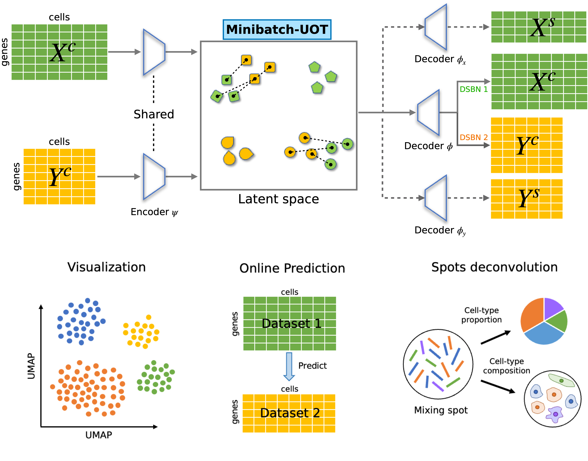

[](https://opensource.org/licenses/MIT)
[](https://badge.fury.io/py/POT)
[](https://uniport.readthedocs.io/en/latest/?badge=latest)
[](https://pepy.tech/project/uniport)

The original paper: 
[a unified single-cell data integration framework with optimal transport](https://www.biorxiv.org/content/10.1101/2022.02.14.480323v1)



Website and documentation: [https://uniport.readthedocs.io](https://uniport.readthedocs.io)

Source Code (MIT): [https://github.com/caokai1073/uniport](https://github.com/caokai1073/uniport)

Author's Homepage: [www.caokai.site](https://www.caokai.site)

## Installation

The **uniport** package can be installed via pip:

```sh
pip3 install uniport
```

## Tutorials

### Please checkout the documentations and tutorials for more information at **[uniport.readthedocs.io](https://uniport.readthedocs.io)**.

### Main function: **uniport.Run**()


**Key parameters includes:**

+ **adatas**: List of AnnData matrices for each dataset.
+ **adata_cm**: AnnData matrix containing common genes from different datasets.
+ **mode**: Choose from ['h', 'v', 'd'] If 'mode=h', integrate data with common genes (Horizontal integration). If 'mode=v', integrate data profiled from the same cells (Vertical integration). If 'mode=d', inetrgate data without common genes (Diagonal integration). Default: 'h'.
+ **lambda_s**: balanced parameter for common and specific genes. Default: 0.5
+ **lambda_recon**: balanced parameter for reconstruct term. Default: 1.0
+ **lambda_kl**: balanced parameter for KL divergence. Default: 0.5
+ **lambda_ot**: balanced parameter for OT. Default: 1.0
+ **max_iteration**: max iterations for training. Training one batch_size samples is one iteration. Default: 30000
+ **ref_id**: id of reference dataset. Default: The domain_id of last dataset
+ **save_OT**: if True, output a global OT plan. Need more memory. Default: False
+ **out**: output of uniPort. Choose from ['latent', 'project', 'predict']. If out=='latent', train the network and output cell embeddings. If out=='project', project data into the latent space and output cell embeddings. If out=='predict', project data into the latent space and output cell embeddings through a specified decoder. Default: 'latent'

## Example
```Python
import uniport as up
import scanpy as sc

# HVG: highly variable genes
adata1 = sc.read_h5ad('adata1.h5ad') # preprocessed data with data1 specific HVG
adata2 = sc.read_h5ad('adata2.h5ad') # preprocessed data with data2 specific HVG, as reference data
adata_cm = sc.read_h5ad('adata_cm.h5ad') # preprocesssed data with common HVG

# integration with both common and dataset-specific genes
adata = up.Run(adatas=[adata1, adata2], adata_cm=adata_cm)
# save global optimal transport matrix
adata, OT = up.Run(adatas=[adata1, adata2], adata_cm=adata_cm, save_OT=True)
# integration with only common genes
adata = up.Run(adata_cm=adata_cm)

# integration without common genes
adata = up.Run(adatas=[adata1, adata2], mode='d')

# integration with paired datasets
adata = up.Run(adatas=[adata1, adata2], mode='v')
```

## Citation
    @article{Cao2022.02.14.480323,
	author = {Cao, Kai and Gong, Qiyu and Hong, Yiguang and Wan, Lin},
	title = {uniPort: a unified computational framework for single-cell data integration with optimal transport},
	year = {2022},
	doi = {10.1101/2022.02.14.480323},
	publisher = {Cold Spring Harbor Laboratory},
	journal = {bioRxiv}}
