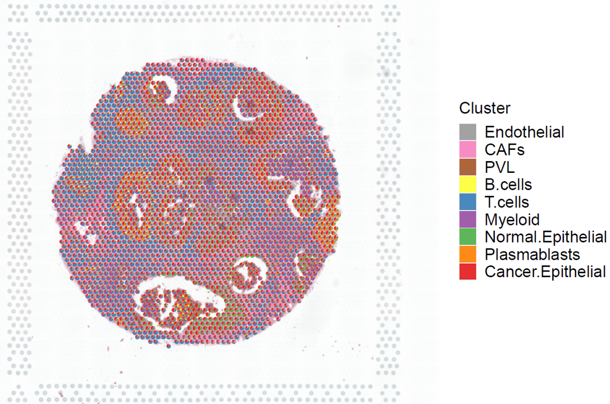
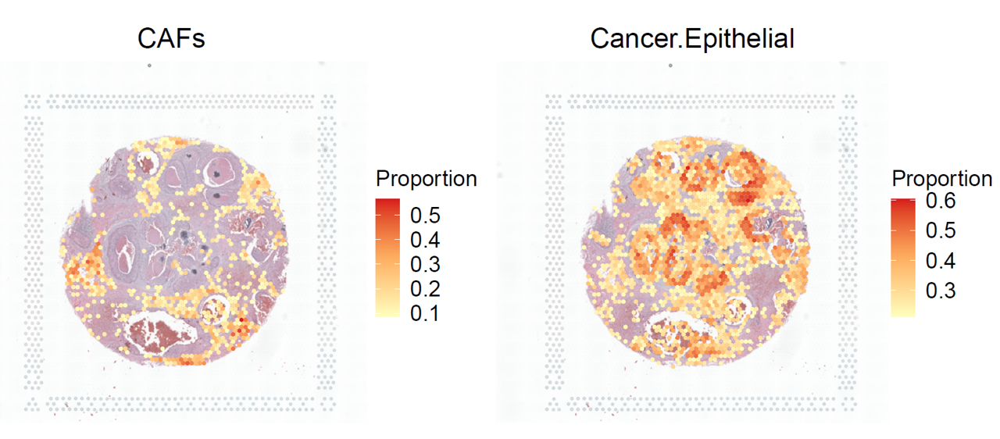

Spatial deconvolution of HER2-positive breast cancer
----------------------------------------------------
Use R packages for plotting temporarily. The python fucntion is  in development.

.. code:: R

    library(scatterpie)
    library(RColorBrewer)
    library(grDevices)
    library(Seurat)
    library(tidyverse)
    library(reshape2)

.. code:: R

    file_path <- '/data/BRCA/'

Load 10x Visium spatial data. The *st* folder contains cellranger outputs, and can be downloaded from `10xGenomics <https://www.10xgenomics.com/cn/resources/datasets/human-breast-cancer-ductal-carcinoma-in-situ-invasive-carcinoma-ffpe-1-standard-1-3-0>`_.

.. code:: R

    brca <- Load10X_Spatial(paste0(file_path,'st/'))
    brca <- NormalizeData(brca)
    brca <- ScaleData(brca)

    # load cluster information of reference scRNA data
    brca_cluster <- read.csv(paste0(file_path,'sc/Whole_miniatlas_meta.csv'), header = T,row.names = 1) %>% .[-1,]

Load plot function. The 'spatial_function.R' is stored `here <https://github.com/caokai1073/uniPort/tree/main/R%20process/spot/>`_.

.. code:: R

    source(paste0(file_path,'spatial_function.R'))

Load OT plan from uniPort output.

.. code:: R

    ot <- read.table(paste0(file_path,'OT_BRCA.txt'),sep = '\t',header = T,row.names = 1)
    ot <- as.data.frame(t(ot))
    rownames(ot) <- sapply(strsplit(rownames(ot),'\\.'),function(x)x[[1]])
    ot_map <- mapCluster(ot,meta = brca_cluster, cluster = 'celltype_major')

Visiualization of cluster proportion.

.. code:: R

    p <- stClusterPie(ot_map = ot_map, st = brca)
    print(p)

.. code:: R
    
    p1 <- stClusterExp(ot_map, brca, cluster = 'CAFs',cut = 0.15, point_size = 1.1)
    p2 <- stClusterExp(ot_map, brca, cluster = 'Cancer.Epithelial',cut = 0.35, point_size = 1.1)
    p1+p2

