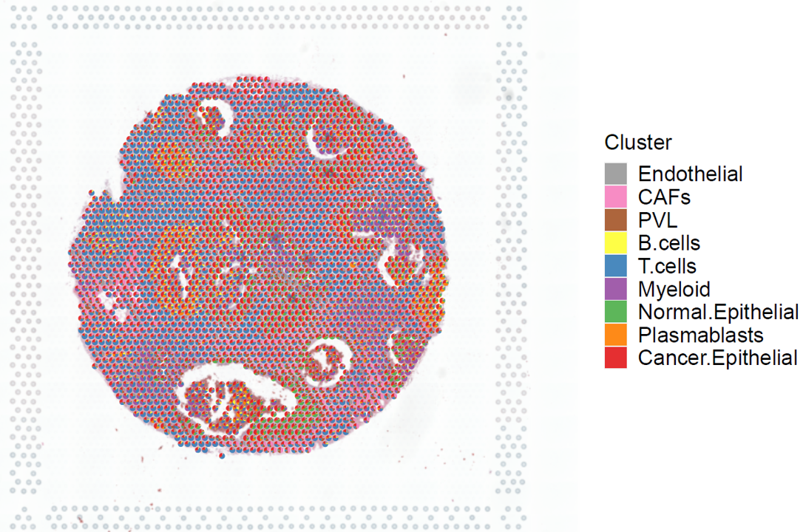
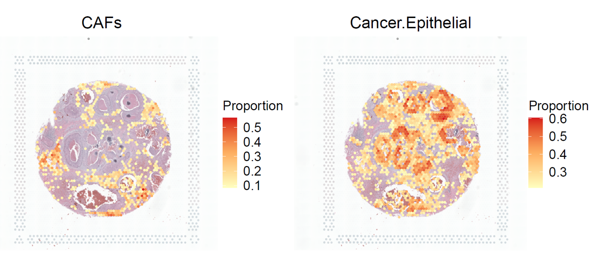

# Plots for uniPort outputs of BRCA

Use R packages for plotting temporarily. The python fucntion is  in development.<br>
```r
library(scatterpie)
library(RColorBrewer)
library(grDevices)
library(Seurat)
library(tidyverse)
library(reshape2)
```
```r
file_path <- '/data/brca/'
```

Load 10x Visium spatial data. The *st* folder contains cellranger outputs, and can be downloaded from [10xGenomics](https://www.10xgenomics.com/cn/resources/datasets/human-breast-cancer-ductal-carcinoma-in-situ-invasive-carcinoma-ffpe-1-standard-1-3-0).

```r
brca <- Load10X_Spatial(paste0(file_path,'st/'))
brca <- NormalizeData(brca)
brca <- ScaleData(brca)

# load cluster information of reference scRNA data
brca_cluster <- read.csv(paste0(file_path,'sc/Whole_miniatlas_meta.csv'), header = T,row.names = 1) %>% .[-1,]
```

Load plot function. The 'spatial_function.R' is stored [here](https://github.com/caokai1073/uniPort/tree/main/R%20process/spot).
```r
source(paste0(file_path,'spatial_function.R'))
```

Load OT plan from uniPort output.
```r
ot <- read.table(paste0(file_path,'OT_BRCA.txt'),sep = '\t',header = T,row.names = 1)
ot <- as.data.frame(t(ot))
rownames(ot) <- sapply(strsplit(rownames(ot),'\\.'),function(x)x[[1]])
ot_map <- mapCluster(ot,meta = brca_cluster, cluster = 'celltype_major')
```

Visiualization of cluster proportion.
```r
p <- stClusterPie(ot_map = ot_map, st = brca)
print(p)
```


```r
p1 <- stClusterExp(ot_map, brca, cluster = 'CAFs',cut = 0.15, point_size = 1.1)
p2 <- stClusterExp(ot_map, brca, cluster = 'Cancer.Epithelial',cut = 0.35, point_size = 1.1)
p1+p2
```
