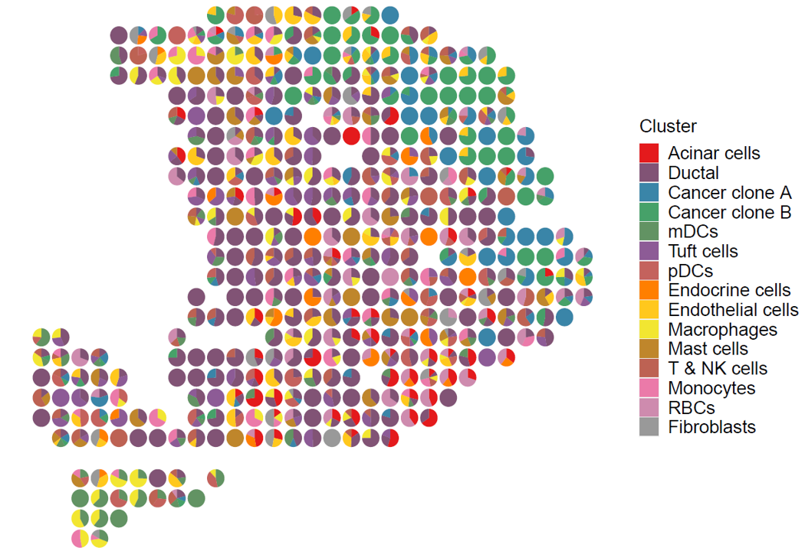

# Plots for uniPort outputs of PDAC

Use R packages for plotting temporarily. The python fucntion is  in development.<br>

```r
library(scatterpie)
library(RColorBrewer)
library(grDevices)
library(Seurat)
library(data.table)
```
```r
file_path <- '/data/pdac/'
```

Load spatial transcriptomics of primary pancreatic cancer tissue and reference scRNA. The datasets can be downloaded from [GSE111672](https://www.ncbi.nlm.nih.gov/geo/query/acc.cgi?acc=GSE111672).

```r
# load st expression matrix
dataA = fread(paste0(file_path,"GSM3036911_PDAC-A-ST1-filtered.txt.gz"), header =T,check.names = F)
dataA = as.data.frame(dataA)
dataA = dataA %>% distinct(Genes,.keep_all = T) %>% column_to_rownames("Genes")

# load paired scRNA data
scdataA = fread(paste0(file_path,'GSE111672_PDAC-A-indrop-filtered-expMat.txt.gz'),header = T) 
scdataA = as.data.frame(scdataA)
scdataA = scdataA[!duplicated(scdataA$Genes),]
rownames(scdataA) <- scdataA$Genes
scdataA <- scdataA[,-1]

# extract celltype information
names = colnames(scdataA)[1:ncol(scdataA)] %>% as.data.frame() %>% {colnames(.) <- 'raw_type';.}
names$cell = paste0('cell',1:ncol(scdataA))
names$cell_type = names$raw_type  
names$cell_type[str_detect(names$cell_type,'Ductal')] = 'Ductal'
names$cell_type[str_detect(names$cell_type,'Acinar cells')] = 'Acinar cells'
names$cell_type[str_detect(names$cell_type,'Cancer clone A')] = 'Cancer clone A'
names$cell_type[str_detect(names$cell_type,'Cancer clone B')] = 'Cancer clone B'
names$cell_type[str_detect(names$cell_type,'mDCs')] = 'mDCs'
names$cell_type[str_detect(names$cell_type,'Tuft cells')] = 'Tuft cells'
names$cell_type[str_detect(names$cell_type,'pDCs')] = 'pDCs'
names$cell_type[str_detect(names$cell_type,'Endocrine cells')] = 'Endocrine cells'
names$cell_type[str_detect(names$cell_type,'Endothelial cells')] = 'Endothelial cells'
names$cell_type[str_detect(names$cell_type,'Macrophages')] = 'Macrophages'
names$cell_type[str_detect(names$cell_type,'Mast cells')] = 'Mast cells'
names$cell_type[str_detect(names$cell_type,'T cells & NK cells')] = 'T & NK cells'
names$cell_type[str_detect(names$cell_type,'Monocytes')] = 'Monocytes'
names$cell_type[str_detect(names$cell_type,'RBCs')] = 'RBCs'
names$cell_type[str_detect(names$cell_type,'Fibroblasts')] = 'Fibroblasts'
rownames(names) <- names$cell
colnames(scdataA) = paste0('cell',1:ncol(scdataA))

# get coordinates of spots from st data
ind <- as.data.frame(t(sapply(
  str_split(colnames(dataA), "x"), 
  function(x){
    x <- as.numeric(x)
    x <- as.vector(x)
  }))) %>% {
    names(.) <- c("row_ind", "col_ind")
    rownames(.) <- paste0(.$row_ind,"x",.$col_ind)
    rownames(.) <- paste0('X',rownames(.))
 ;.}
```

Load plot function. The 'spatial_function.R' is stored [here](https://github.com/caokai1073/uniPort/tree/main/R%20process/spot).
```r
source(paste0(file_path,'spatial_function.R'))
```

Load OT plan from uniPort output.
```r
ot <- read.table(paste0(file_path,'OT_PDAC.txt'),sep = '\t',header = T, row.names = 1)
ot <- as.data.frame(t(ot))
rownames(ot) <- sapply(strsplit(rownames(ot),'\\.'),function(x)x[[1]])
# We provide balance option for scaling cluster proportion in st data through multiplying cluster ratio in scRNA reference.
ot_map <- mapCluster(ot, meta = names, cluster = 'cell_type', min_cut = 0.25, balance = T)
```

Visiualization of cluster proportion.
```r
p <- stClusterPie(ot_map = ot_map, coord = ind, pie_scale = 0.8)
print(p)
```


```r
p1 <- stClusterExp(ot_map, coord = ind, cluster = 'Cancer clone A',cut = 0.25)
p2 <- stClusterExp(ot_map, coord = ind, cluster = 'Ductal',cut = 0.25)
p1+p2
```
